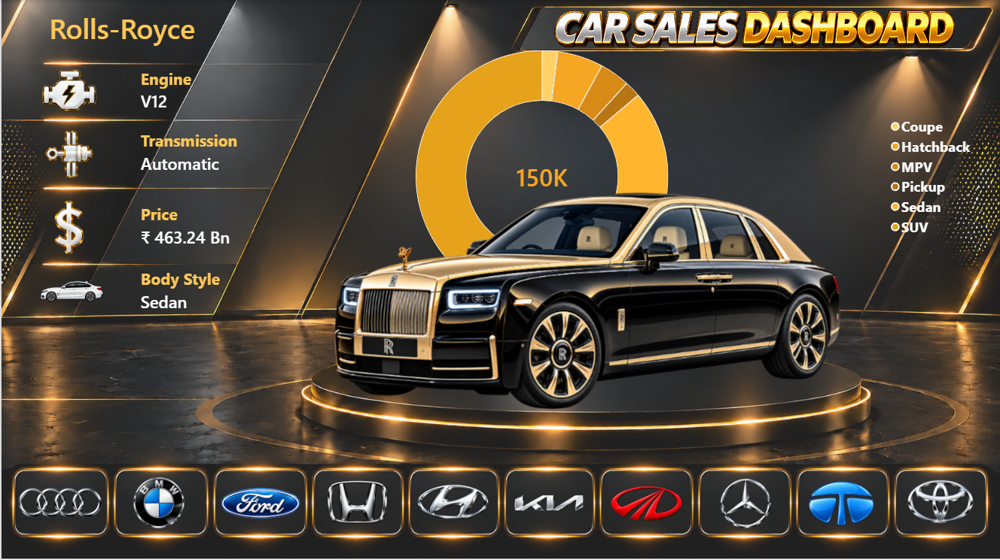

# 🚗 Car Sales Analytics Dashboard

## 📊 Project Overview

An end-to-end **Car Sales Analytics** project using **MySQL, SQL, Power BI, DAX, and Power Query** to analyze 25,000+ automobile sales records and generate actionable business insights.

The project focuses on **sales, revenue, pricing, customer ratings, vehicle characteristics, brands, models, regions, and dealer performance**.

---
## Dashboard

---
## 🎯 Objectives

- Analyze overall car sales performance
- Identify top-performing brands and models
- Analyze revenue and pricing
- Compare vehicle body styles, engines, transmissions, and fuel types
- Analyze customer ratings and discounts
- Evaluate regional and dealer performance
- Analyze sales and revenue trends
- Build an interactive Power BI dashboard

---

## 🛠️ Technologies

- **MySQL** – Database and SQL analysis
- **SQL** – Data analysis and business queries
- **Power BI** – Interactive dashboard
- **DAX** – Dynamic calculations and KPIs
- **Power Query** – Data transformation
- **CSV / Excel** – Source data
- **Git & GitHub** – Version control

---

## 📂 Dataset

The dataset contains **25,000+ car sales records** with information including:

- Sale ID
- Sales Date
- Brand
- Model
- Year
- Body Style
- Engine
- Transmission
- Fuel Type
- Color
- Mileage
- Price
- Units Sold
- Discount Percentage
- Revenue
- Dealer Region
- Dealer Type
- Customer Rating
- Inventory Days
- Service Cost
- Insurance

---

## 🗄️ SQL Analysis

MySQL was used to perform business and sales analysis.

### Analysis Performed

- Overall sales analysis
- Brand performance
- Model performance
- Revenue analysis
- Body style analysis
- Engine analysis
- Transmission analysis
- Fuel type analysis
- Regional analysis
- Dealer analysis
- Pricing analysis
- Discount analysis
- Customer rating analysis
- Monthly and yearly trend analysis

### SQL Concepts

- SELECT
- WHERE
- GROUP BY
- HAVING
- ORDER BY
- DISTINCT
- Aggregate Functions
- CASE
- Subqueries
- CTEs
- Window Functions
- RANK()
- DENSE_RANK()
- Date Functions

---

## 📊 Power BI Dashboard

The SQL analysis was converted into an interactive **Car Sales Power BI Dashboard** with a premium automotive design.

### Dashboard KPIs

- Total Cars Sold
- Total Revenue
- Average Price
- Average Customer Rating
- Average Discount

### Vehicle Information

- Engine
- Transmission
- Price
- Body Style

### Interactive Brand Selection

Users can select brands using interactive brand logos:

**Audi | BMW | Ford | Honda | Hyundai | Kia | Mahindra | Mercedes-Benz | Tata | Toyota**

Selecting a brand dynamically updates the dashboard.

---

## 📈 Dashboard Visuals

- KPI Cards
- Donut Chart
- Brand Logo Selector
- Dynamic Car Images
- Revenue Analysis
- Brand Analysis
- Body Style Analysis
- Vehicle Information
- Interactive Filtering
- Dynamic DAX Measures

---

## 🧮 DAX & Data Modeling

Created dynamic measures for:

- Total Cars Sold
- Total Revenue
- Average Price
- Average Rating
- Average Discount
- Selected Brand
- Selected Engine
- Selected Transmission
- Selected Body Style

Supporting tables include:

- **Car_Sales**
- **Calendar**
- **Brand**

The model enables interactive filtering and dynamic dashboard analysis.

---

## 🔄 Project Workflow

**Raw Dataset**  
↓  
**MySQL Database**  
↓  
**SQL Analysis**  
↓  
**Data Transformation**  
↓  
**Power Query**  
↓  
**Power BI Data Model**  
↓  
**DAX Measures**  
↓  
**Interactive Dashboard**  
↓  
**Business Insights**

---

## 💡 Business Questions

- Which brand has the highest sales?
- Which brand generates the highest revenue?
- Which models are best sellers?
- Which body style is most popular?
- Which engine type has the highest sales?
- Which transmission is most preferred?
- Which fuel type performs best?
- Which region generates the highest revenue?
- Which dealer type performs best?
- Which brands have the highest average price?
- Which brands have the highest customer ratings?
- What is the average discount?
- How does revenue change over time?

---

## 🚀 Project Highlights

- Analyzed **25,000+ records**
- Built a MySQL database
- Performed advanced SQL analysis
- Used CTEs and Window Functions
- Created an interactive Power BI dashboard
- Developed dynamic DAX measures
- Implemented interactive brand selection
- Added dynamic car images
- Added automotive brand logos
- Created KPI-driven reporting
- Analyzed sales, revenue, pricing, ratings, and regional performance
- Designed a premium automotive-themed dashboard

---

## 📁 Project Structure

    Car-Sales-Analytics/
    │
    ├── Data/
    │   └── Car_Sales.csv
    │
    ├── SQL/
    │   └── car_sales_analysis.sql
    │
    ├── PowerBI/
    │   └── Car_Sales_Dashboard.pbix
    │
    ├── Images/
    │   ├── Car/
    │   └── Car_Logo/
    │
    ├── Screenshots/
    │   └── dashboard.png
    │
    └── README.md
---
## 🎯 Skills Demonstrated
### SQL
- Data Analysis
- Data Aggregation
- CTEs
- Subqueries
- Window Functions
- Ranking
- Date Analysis
- Business Analysis
### Power BI
- Data Modeling
- DAX
- Power Query
- KPI Development
- Interactive Dashboards
- Slicers
- Dynamic Visuals
- Image URLs
- Data Visualization
### Data Analytics
- Exploratory Data Analysis
- Sales Analysis
- Revenue Analysis
- Customer Analysis
- Pricing Analysis
- Trend Analysis
- Performance Analysis
- Business Intelligence

--- 
## 📸 Dashboard Preview
The dashboard provides an interactive automotive analytics experience with:
- Dynamic brand selection
- Vehicle images
- KPI cards
- Revenue analysis
- Sales analysis
- Donut chart
- Vehicle information
- Premium automotive design
---
## 📌 Conclusion
This project demonstrates an end-to-end data analytics workflow, from raw automobile sales data to SQL analysis, data transformation, data modeling, DAX calculations, and interactive Power BI visualization.
It demonstrates how data can be transformed into meaningful business insights for understanding automobile sales performance, customer preferences, pricing, revenue, and regional trends.

## 👨‍💻 Author
## Mehesh P
Data Analytics | SQL | Power BI | Python | Data Science
